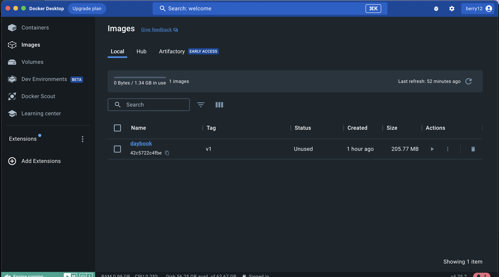
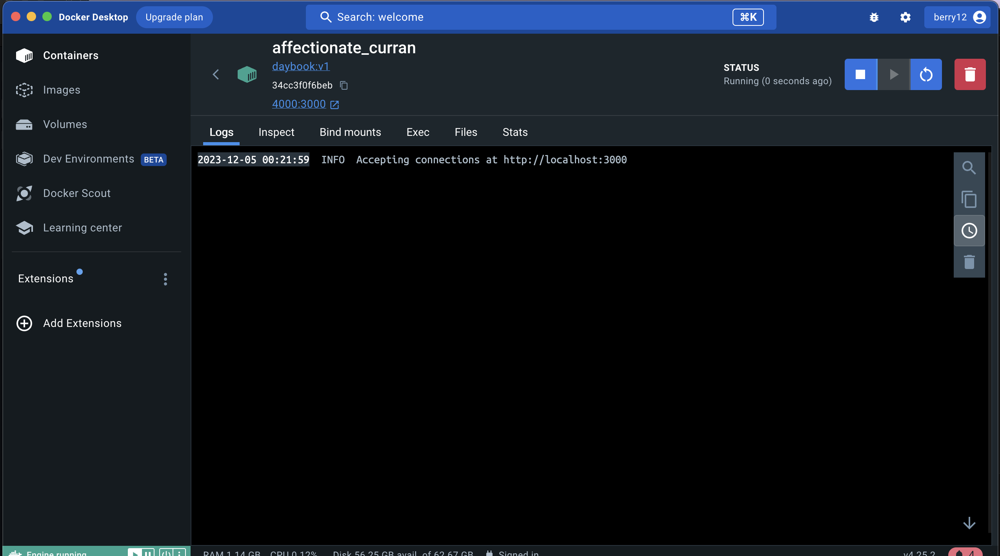

# Learning Docker

I have used a simple ReactJs application for doing hands on with Docker. Reference [Daybook UI](https://github.com/HARIKSREEE/Daybook_ui)

## Concepts I learned so far

### Docker

* Containers - An isolated run time which includes only the necessary resources for the application to run.
* Images - Base artifacts for running any container. Images includes all the dependencies to run the application.
* Dockerfile - A human readable document to specify the instrcutions for docker to create the image.
* Volumes -  
    1) Mount volume - Since container is an isolated runtime from the host environment, we can't persist the data by default. We can use Mount volumes to persist data in the host machine. This helps to retain the data even after stopping the container.

    2) Bind volume - In order to access a directory from host, we can use Bind volume.

## Understanding of Dockerfile

I have tried to add comment in the Dockerfile itself about my understanding of each command. [Dockerfile](https://github.com/sreelakshmiHksr/Daybook_ui/blob/main/Dockerfile)

## Docker hands on 

1. After creating the image, viewing it in Docker Desktop  

2. Running the container  

 > Note: I will be updating this document as and when I complete each tasks

